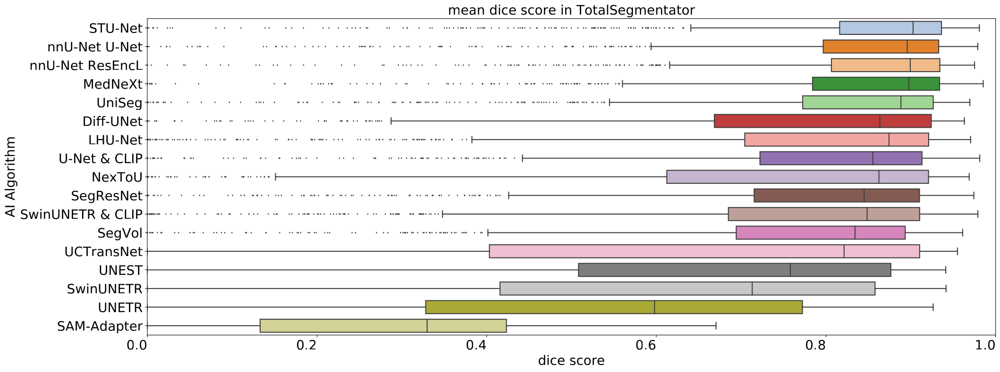
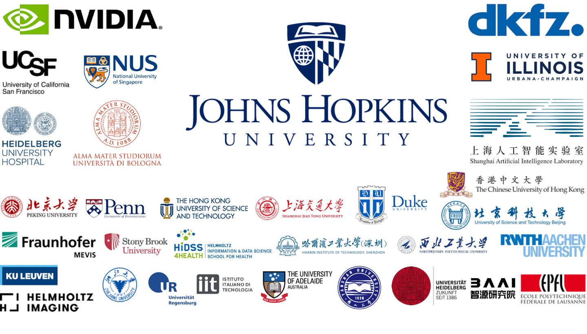

<div align="center">
  
</div>


<h1 align="center" style="font-size: 60px; margin-bottom: 4px">Touchstone Benchmark</h1>
<p align="center">
    <a href='https://www.cs.jhu.edu/~zongwei/advert/TutorialBenchmarkV1.pdf'></a>
    <a href='https://www.cs.jhu.edu/~zongwei/advert/Call4Benchmark.pdf'></a>
    <br/>
    <a href="https://github.com/MrGiovanni/Touchstone"></a>
    <a href="https://twitter.com/bodymaps317"></a>
</p>

We present Touchstone, a large-scale  medical segmentation benchmark based on annotated **5,195** CT volumes from **76** hospitals for training, and **6,933** CT volumes from **8** additional hospitals for testing. We invite AI inventors to train their models on AbdomenAtlas, and we independently evaluate their algorithms. We have already collaborated with **14** influential research teams, and we remain accepting new submissions.

> [!NOTE]
> Training set
> - Touchstone 1.0: [AbdomenAtlas1.0Mini](https://huggingface.co/datasets/AbdomenAtlas/AbdomenAtlas1.0Mini) (*N*=5,195)
> - Touchstone 2.0: [AbdomenAtlas1.1Mini](https://huggingface.co/datasets/AbdomenAtlas/_AbdomenAtlas1.1Mini) (*N*=9,262)
> 
> Test set 
> - Proprietary [JHH dataset](https://www.sciencedirect.com/science/article/pii/S2211568419301391) (*N*=5,172)
> - Public [TotalSegmentator V2](https://github.com/wasserth/TotalSegmentator) dataset (*N*=1,228)
> - Public [DAP Atlas](https://github.com/alexanderjaus/AtlasDataset) dataset (*N*=533)

# Touchstone 1.0 Leaderboard 

<b>Touchstone Benchmark: Are We on the Right Way for Evaluating AI Algorithms for Medical Segmentation?</b> <br/>
[Pedro R. A. S. Bassi](https://scholar.google.com.hk/citations?user=NftgL6gAAAAJ)<sup>1</sup>, [Wenxuan Li](https://scholar.google.com/citations?hl=en&user=tpNZM2YAAAAJ)<sup>1</sup>, [Yucheng Tang](https://scholar.google.com.hk/citations?hl=en&user=0xheliUAAAAJ)<sup>2</sup>, [Fabian Isensee](https://scholar.google.com.hk/citations?hl=en&user=PjerEe4AAAAJ)<sup>3</sup>, ..., [Alan Yuille](https://www.cs.jhu.edu/~ayuille/)<sup>1</sup>, [Zongwei Zhou](https://www.zongweiz.com/)<sup>1</sup> <br/>
<sup>1</sup>Johns Hopkins University, <sup>2</sup>NVIDIA, <sup>3</sup>DKFZ <br/>
[project](https://www.zongweiz.com/dataset) | [paper](https://www.cs.jhu.edu/~alanlab/Pubs24/bassi2024touchstone.pdf) | [code](https://github.com/MrGiovanni/Touchstone) <br/>


| rank | model  | organization | average DSC | paper | github
|:---|:---|:---|:---:|:---:|:---:|
| 1 | MedNeXt 🏆 | DKFZ | 89.2 | [](https://arxiv.org/pdf/2303.09975) | [](https://github.com/MIC-DKFZ/MedNeXt) |
| 1 | STU-NetB 🏆 | Shanghai AI Lab | 89.0 | [](https://arxiv.org/pdf/2304.06716) | [](https://github.com/uni-medical/STU-Net) |

<details>
<summary style="margin-left: 25px;">Aorta - NexToU 🏆 </summary>
<div style="margin-left: 25px;">

| rank | model  | organization | DSC | paper | github
|:---|:---|:---|:---:|:---:|:---:|
| 1 | NexToU 🏆 | HIT | 86.4 | [](https://arxiv.org/pdf/2305.15911) | [](https://github.com/PengchengShi1220/NexToU) |

</div>
</details>

<details>
<summary style="margin-left: 25px;">Gallbladder - STU-NetB & MedNeXt 🏆 </summary>
<div style="margin-left: 25px;">

| rank | model  | organization | DSC | paper | github
|:---|:---|:---|:---:|:---:|:---:|
| 1 | STU-NetB 🏆 | Shanghai AI Lab | 85.5 | [](https://arxiv.org/pdf/2304.06716) | [](https://github.com/uni-medical/STU-Net) |
| 1 | MedNeXt 🏆 | DKFZ | 85.3 | [](https://arxiv.org/pdf/2303.09975) | [](https://github.com/MIC-DKFZ/MedNeXt) |

</div>
</details>

# Analyze Benchmark Results

<p align="center">
  
</p>


We provide per-sample results for each checkpoint in test sets #2 and #3. These results are saved as csv files, structured as follows:

```
totalsegmentator_results
    ├── Diff-UNet
    │   ├── dsc.csv
    │   └── nsd.csv
    ├── LHU-Net
    │   ├── dsc.csv
    │   └── nsd.csv
    ├── MedNeXt
    │   ├── dsc.csv
    │   └── nsd.csv
    ├── ...
dapatlas_results
    ├── Diff-UNet
    │   ├── dsc.csv
    │   └── nsd.csv
    ├── LHU-Net
    │   ├── dsc.csv
    │   └── nsd.csv
    ├── MedNeXt
    │   ├── dsc.csv
    │   └── nsd.csv
    ├── ...
```

#### 1. Clone the GitHub repository

```bash
git clone https://github.com/MrGiovanni/Touchstone
cd Touchstone
```

#### 2. Create environments

```bash
conda env create -f environment.yml
source activate touchstone
python -m ipykernel install --user --name touchstone --display-name "touchstone"
```

#### 3. Reproduce analysis figures in our paper

#### Figure 1 - Dataset statistics:
```bash
cd notebooks
jupyter nbconvert --to notebook --execute --ExecutePreprocessor.kernel_name=touchstone TotalSegmentatorMetadata.ipynb
jupyter nbconvert --to notebook --execute --ExecutePreprocessor.kernel_name=touchstone DAPAtlasMetadata.ipynb
#results: plots are saved inside Touchstone/outputs/plotsTotalSegmentator/ and Touchstone/outputs/plotsDAPAtlas/
```

#### Figure 2 - Potential confrounders significantly impact AI performance:
```bash
cd ../plot
python AggregatedBoxplot.py --stats
#results: Touchstone/outputs/summary_groups.pdf
```

#### Appendix D.2.3 - Statistical significance maps:
```bash
#statistical significance maps (Appendix D.2.3):
python PlotAllSignificanceMaps.py
python PlotAllSignificanceMaps.py --organs second_half
python PlotAllSignificanceMaps.py --nsd
python PlotAllSignificanceMaps.py --organs second_half --nsd
#results: Touchstone/outputs/heatmaps
```

#### Appendix D.4 and D.5 - Box-plots for per-group and per-organ results, with statistical tests:
```bash
cd ../notebooks
jupyter nbconvert --to notebook --execute --ExecutePreprocessor.kernel_name=touchstone GroupAnalysis.ipynb
#results: Touchstone/outputs/box_plots
```

#### 4. Custom Analysis

The csv results files in totalsegmentator_results/ and dapatlas_results/ contain per-sample dsc and nsd scores. Rich meatdata for each one of those samples (sex, age, scanner, diagnosis,...) are available in metaTotalSeg.csv and 'Clinical Metadata FDG PET_CT Lesions.csv', for TotalSegmentator and DAP Atlas, respectively. The code in TotalSegmentatorMetadata.ipynb and DAPAtlasMetadata.ipynb extracts this meatdata into simplfied group lists (e.g., a list of all samples representing male patients), and saves these lists in the folders plotsTotalSegmentator/ and plotsDAPAtlas/. You can modify the code to generate custom sample lists (e.g., all men aged 30-35). To compare a set of groups, the filenames of all lists in the set should begin with the same name. For example, comp1_list_a.pt, comp1_list_b.pt, comp1_list_C.pt can represent a set of 3 groups. Then, PlotGroup.py can draw boxplots and perform statistical tests comparing the AI algorithm's results (dsc and nsd) for the samples inside the different custom lists you created. In our example, you just just need to specify --group_name comp1 when running PlotGroup.py:

```bash
python utils/PlotGroup.py --ckpt_root totalsegmentator_results/ --group_root outputs/plotsTotalSegmentator/ --group_name comp1 --organ liver --stats
```

# Citation

Please cite the following papers if you find our leaderboard or dataset helpful.

```
@article{li2024abdomenatlas,
  title={AbdomenAtlas: A large-scale, detailed-annotated, \& multi-center dataset for efficient transfer learning and open algorithmic benchmarking},
  author={Li, Wenxuan and Qu, Chongyu and Chen, Xiaoxi and Bassi, Pedro RAS and Shi, Yijia and Lai, Yuxiang and Yu, Qian and Xue, Huimin and Chen, Yixiong and Lin, Xiaorui and others},
  journal={Medical Image Analysis},
  pages={103285},
  year={2024},
  publisher={Elsevier}
}

@inproceedings{li2024well,
  title={How Well Do Supervised Models Transfer to 3D Image Segmentation?},
  author={Li, Wenxuan and Yuille, Alan and Zhou, Zongwei},
  booktitle={The Twelfth International Conference on Learning Representations},
  year={2024}
}

@article{qu2023abdomenatlas,
  title={Abdomenatlas-8k: Annotating 8,000 CT volumes for multi-organ segmentation in three weeks},
  author={Qu, Chongyu and Zhang, Tiezheng and Qiao, Hualin and Tang, Yucheng and Yuille, Alan L and Zhou, Zongwei and others},
  journal={Advances in Neural Information Processing Systems},
  volume={36},
  year={2023}
}
```

# Acknowledgement

This work was supported by the Lustgarten Foundation for Pancreatic Cancer Research and the McGovern Foundation. Paper content is covered by patents pending.

<div align="center">
  
</div>