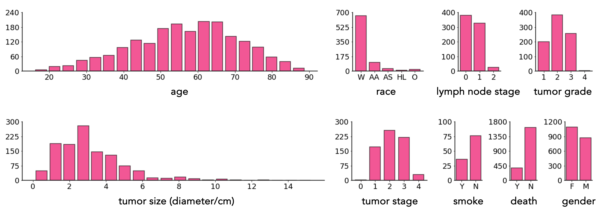

<div align="center">
  
</div>

<h1 align="center" style="font-size: 60px; margin-bottom: 4px">Touchstone Benchmark</h1>

<p align="center">
    <a href='https://www.cs.jhu.edu/~zongwei/advert/TutorialBenchmarkV1.pdf'>
        
    </a>
    <a href='https://www.cs.jhu.edu/~zongwei/advert/Call4Benchmark.pdf'>
        
    </a>
</p>

<div align="center">


[](https://github.com/MrGiovanni/Touchstone/tree/main?tab=readme-ov-file#touchstone-10-leaderboard)
[](https://github.com/MrGiovanni/Touchstone/tree/main?tab=readme-ov-file#touchstone-10-dataset)
[](https://github.com/MrGiovanni/Touchstone/tree/main?tab=readme-ov-file#touchstone-10-model) <br/>

[](https://github.com/MrGiovanni/SuPreM/stargazers) 
<a href="https://twitter.com/bodymaps317">
        
</a><br/>
**Subscribe us: https://groups.google.com/u/2/g/bodymaps**  

</div>


We present Touchstone, a large-scale  medical segmentation benchmark based on annotated **5,195** CT volumes from **76** hospitals for training, and **6,933** CT volumes from **8** additional hospitals for testing. We invite AI inventors to train their models on AbdomenAtlas, and we independently evaluate their algorithms. We have already collaborated with **14** influential research teams, and we remain accepting new submissions.

# Paper

<b>Touchstone Benchmark: Are We on the Right Way for Evaluating AI Algorithms for Medical Segmentation?</b> <br/>
[Pedro R. A. S. Bassi](https://scholar.google.com.hk/citations?user=NftgL6gAAAAJ)<sup>1</sup>, [Wenxuan Li](https://scholar.google.com/citations?hl=en&user=tpNZM2YAAAAJ)<sup>1</sup>, [Yucheng Tang](https://scholar.google.com.hk/citations?hl=en&user=0xheliUAAAAJ)<sup>2</sup>, [Fabian Isensee](https://scholar.google.com.hk/citations?hl=en&user=PjerEe4AAAAJ)<sup>3</sup>, ..., [Alan Yuille](https://www.cs.jhu.edu/~ayuille/)<sup>1</sup>, [Zongwei Zhou](https://www.zongweiz.com/)<sup>1</sup> <br/>
<sup>1</sup>Johns Hopkins University, <sup>2</sup>NVIDIA, <sup>3</sup>DKFZ <br/>
NeurIPS 2024 <br/>
[JHU CS News](https://www.cs.jhu.edu/news/a-touchstone-of-medical-artificial-intelligence/) <br/>

<a href='https://www.zongweiz.com/dataset'></a> <a href='https://www.cs.jhu.edu/~zongwei/publication/bassi2024touchstone.pdf'></a> <a href='document/jhu_seminar_slides.pdf'></a> <a href='document/rsna2024_abstract.pdf'></a> <a href='document/rsna2024_slides.pdf'></a> [](https://youtu.be/tPnTCFUTjjY)

# Touchstone 1.0 Leaderboard 

| rank | model  | organization | average DSC | paper | github
|:---|:---|:---|:---:|:---:|:---:|
| 🏆 | MedNeXt | DKFZ | 89.2 | [](https://arxiv.org/pdf/2303.09975) | [](https://github.com/MIC-DKFZ/MedNeXt) |
| 🏆 | MedFormer | Rutgers | 89.0 | [](https://arxiv.org/abs/2203.00131) | [](https://github.com/yhygao/CBIM-Medical-Image-Segmentation) |
| 3 | STU-Net-B | Shanghai AI Lab | 89.0 | [](https://arxiv.org/pdf/2304.06716) | [](https://github.com/uni-medical/STU-Net) |
| 4 | nnU-Net U-Net | DKFZ | 88.9 | [](https://arxiv.org/abs/1809.10486) | [](https://github.com/MIC-DKFZ/nnUNet) |
| 5 | nnU-Net ResEncL | DKFZ | 88.8 | [](https://arxiv.org/abs/1809.10486) | [](https://github.com/MIC-DKFZ/nnUNet) |
| 6 | UniSeg | NPU | 88.8 | [](https://arxiv.org/abs/2304.03493) | [](https://github.com/yeerwen/UniSeg) |
| 7 | Diff-UNet | HKUST | 88.5 | [](https://arxiv.org/abs/2303.10326) | [](https://github.com/ge-xing/Diff-UNet) |
| 8 | LHU-Net | UR | 88.0 | [](https://arxiv.org/abs/2404.05102) | [](https://github.com/xmindflow/LHUNet) |
| 9 | NexToU | HIT | 87.8 | [](https://arxiv.org/abs/2305.15911) | [](https://github.com/PengchengShi1220/NexToU) |
| 10 | SegVol | BAAI | 87.1 | [](https://arxiv.org/abs/2311.13385) | [](https://github.com/BAAI-DCAI/SegVol) |
| 11 | U-Net & CLIP | CityU | 87.1 | [](https://arxiv.org/abs/2301.00785) | [](https://github.com/ljwztc/CLIP-Driven-Universal-Model) |
| 12 | Swin UNETR & CLIP | CityU | 86.7 | [](https://arxiv.org/abs/2301.00785) | [](https://github.com/ljwztc/CLIP-Driven-Universal-Model) |
| 13 | UNesT | NVIDIA | 84.9 | [](https://arxiv.org/abs/2303.10745) | [](https://github.com/Project-MONAI/tutorials) |
| 14 | Swin UNETR | NVIDIA | 84.8 | [](https://arxiv.org/abs/2211.11537) | [](https://github.com/Project-MONAI/tutorials) |
| 15 | UNETR | NVIDIA| 83.3 | [](https://arxiv.org/abs/2111.04004) | [](https://github.com/Project-MONAI/tutorials) |
| 16 | UCTransNet | Northeastern University | 81.1 | []([https://arxiv.org/abs/2211.11537](https://arxiv.org/pdf/2109.04335)) | []([https://github.com/McGregorWwww/UCTransNet](https://github.com/McGregorWwww/UCTransNet)) |
| 17 | SAM-Adapter | Duke | 73.4 | [](https://arxiv.org/abs/2404.09957) | [](https://github.com/mazurowski-lab/finetune-SAM) |


<details>
<summary style="margin-left: 25px;">Aorta - NexToU 🏆 </summary>
<div style="margin-left: 25px;">

| rank | model  | organization | DSC | paper | github |
|:---|:---|:---|:---:|:---:|:---:|
| 🏆 | NexToU | HIT | 86.4 | [](https://arxiv.org/pdf/2305.15911) | [](https://github.com/PengchengShi1220/NexToU) |
| 2 | MedNeXt | DKFZ | 83.1 | [](https://arxiv.org/pdf/2303.09975) | [](https://github.com/MIC-DKFZ/MedNeXt) |
| 3 | UniSeg | NPU | 82.3 | [](https://arxiv.org/abs/2304.03493) | [](https://github.com/yeerwen/UniSeg) |
| 4 | STU-Net-B | Shanghai AI Lab | 82.1 | [](https://arxiv.org/pdf/2304.06716) | [](https://github.com/uni-medical/STU-Net) |
| 5 | nnU-Net ResEncL | DKFZ | 81.4 | [](https://arxiv.org/abs/1809.10486) | [](https://github.com/MIC-DKFZ/nnUNet) |
| 6 | Diff-UNet | HKUST | 81.2 | [](https://arxiv.org/abs/2303.10326) | [](https://github.com/ge-xing/Diff-UNet) |
| 7| Swin UNETR | NVIDIA | 81.1 | [](https://arxiv.org/abs/2211.11537) | [](https://github.com/Project-MONAI/tutorials) |
| 8 | SegVol | BAAI | 80.2 | [](https://arxiv.org/abs/2311.13385) | [](https://github.com/BAAI-DCAI/SegVol) |
| 9 | UNesT | NVIDIA | 78.6 | [](https://arxiv.org/abs/2303.10745) | [](https://github.com/Project-MONAI/tutorials) |
| 10 | Swin UNETR & CLIP | CityU | 78.1 | [](https://arxiv.org/abs/2301.00785) | [](https://github.com/ljwztc/CLIP-Driven-Universal-Model) |
| 11 | U-Net & CLIP | CityU | 77.1 | [](https://arxiv.org/abs/2301.00785) | [](https://github.com/ljwztc/CLIP-Driven-Universal-Model) |
| 12 | SAM-Adapter | Duke | 62.8 | [](https://arxiv.org/abs/2404.09957) | [](https://github.com/mazurowski-lab/finetune-SAM) |
| 13 | UNETR | NVIDIA | 52.1 | [](https://arxiv.org/abs/2111.04004) | [](https://github.com/Project-MONAI/tutorials) |


</div>
</details>

<details>
<summary style="margin-left: 25px;">Gallbladder - STU-Net-B & MedNeXt 🏆 </summary>
<div style="margin-left: 25px;">

| rank | model  | organization | DSC | paper | github |
|:---|:---|:---|:---:|:---:|:---:|
| 🏆 | STU-Net-B | Shanghai AI Lab | 85.5 | [](https://arxiv.org/pdf/2304.06716) | [](https://github.com/uni-medical/STU-Net) |
| 🏆 | MedNeXt | DKFZ | 85.3 | [](https://arxiv.org/pdf/2303.09975) | [](https://github.com/MIC-DKFZ/MedNeXt) |
| 3 | nnU-Net ResEncL | DKFZ | 84.9 | [](https://arxiv.org/abs/1809.10486) | [](https://github.com/MIC-DKFZ/nnUNet) |
| 4 | UniSeg | NPU | 84.7 | [](https://arxiv.org/abs/2304.03493) | [](https://github.com/yeerwen/UniSeg) |
| 5 | Diff-UNet | HKUST | 83.8 | [](https://arxiv.org/abs/2303.10326) | [](https://github.com/ge-xing/Diff-UNet) |
| 6 | NexToU | HIT | 82.3 | [](https://arxiv.org/abs/2305.15911) | [](https://github.com/PengchengShi1220/NexToU) |
| 7 | U-Net & CLIP | CityU | 82.1 | [](https://arxiv.org/abs/2301.00785) | [](https://github.com/ljwztc/CLIP-Driven-Universal-Model) |
| 8 | Swin UNETR & CLIP | CityU | 80.2 | [](https://arxiv.org/abs/2301.00785) | [](https://github.com/ljwztc/CLIP-Driven-Universal-Model) |
| 9 | SegVol | BAAI | 79.3 | [](https://arxiv.org/abs/2311.13385) | [](https://github.com/BAAI-DCAI/SegVol) |
| 10 | Swin UNETR | NVIDIA | 69.2 | [](https://arxiv.org/abs/2211.11537) | [](https://github.com/Project-MONAI/tutorials) |
| 11 | UNesT | NVIDIA | 62.1 | [](https://arxiv.org/abs/2303.10745) | [](https://github.com/Project-MONAI/tutorials) |
| 12 | SAM-Adapter | Duke | 49.4 | [](https://arxiv.org/abs/2404.09957) | [](https://github.com/mazurowski-lab/finetune-SAM) |
| 13 | UNETR | NVIDIA | 43.8 | [](https://arxiv.org/abs/2111.04004) | [](https://github.com/Project-MONAI/tutorials) |


</div>
</details>

<details>
<summary style="margin-left: 25px;">KidneyL - Diff-UNet 🏆 </summary>
<div style="margin-left: 25px;">

| rank | model  | organization | DSC | paper | github |
|:---|:---|:---|:---:|:---:|:---:|
| 🏆 | Diff-UNet | HKUST | 91.9 | [](https://arxiv.org/abs/2303.10326) | [](https://github.com/ge-xing/Diff-UNet) |
| 2 | nnU-Net ResEncL | DKFZ | 91.9 | [](https://arxiv.org/abs/1809.10486) | [](https://github.com/MIC-DKFZ/nnUNet) |
| 3 | STU-Net-B | Shanghai AI Lab | 91.9 | [](https://arxiv.org/pdf/2304.06716) | [](https://github.com/uni-medical/STU-Net) |
| 4 | MedNeXt | DKFZ | 91.8 | [](https://arxiv.org/pdf/2303.09975) | [](https://github.com/MIC-DKFZ/MedNeXt) |
| 5 | SegVol | BAAI | 91.8 | [](https://arxiv.org/abs/2311.13385) | [](https://github.com/BAAI-DCAI/SegVol) |
| 6 | UniSeg | NPU | 91.5 | [](https://arxiv.org/abs/2304.03493) | [](https://github.com/yeerwen/UniSeg) |
| 7 | U-Net & CLIP | CityU | 91.1 | [](https://arxiv.org/abs/2301.00785) | [](https://github.com/ljwztc/CLIP-Driven-Universal-Model) |
| 8 | Swin UNETR & CLIP | CityU | 91.0 | [](https://arxiv.org/abs/2301.00785) | [](https://github.com/ljwztc/CLIP-Driven-Universal-Model) |
| 9 | NexToU | HIT | 89.6 | [](https://arxiv.org/abs/2305.15911) | [](https://github.com/PengchengShi1220/NexToU) |
| 10 | SAM-Adapter | Duke | 87.3 | [](https://arxiv.org/abs/2404.09957) | [](https://github.com/mazurowski-lab/finetune-SAM) |
| 11 | Swin UNETR | NVIDIA | 85.5 | [](https://arxiv.org/abs/2211.11537) | [](https://github.com/Project-MONAI/tutorials) |
| 12 | UNesT | NVIDIA | 85.4 | [](https://arxiv.org/abs/2303.10745) | [](https://github.com/Project-MONAI/tutorials) |
| 13 | UNETR | NVIDIA | 63.7 | [](https://arxiv.org/abs/2111.04004) | [](https://github.com/Project-MONAI/tutorials) |

                                                                                                                                  
</div>
</details>

<details>
<summary style="margin-left: 25px;">KidneyR - Diff-UNet 🏆 </summary>
<div style="margin-left: 25px;">

| rank | model  | organization | DSC | paper | github |
|:---|:---|:---|:---:|:---:|:---:|
| 🏆 | Diff-UNet | HKUST | 92.8 | [](https://arxiv.org/abs/2303.10326) | [](https://github.com/ge-xing/Diff-UNet) |
| 2 | MedNeXt | DKFZ | 92.6 | [](https://arxiv.org/pdf/2303.09975) | [](https://github.com/MIC-DKFZ/MedNeXt) |
| 3 | nnU-Net ResEncL | DKFZ | 92.6 | [](https://arxiv.org/abs/1809.10486) | [](https://github.com/MIC-DKFZ/nnUNet) |
| 4 | STU-Net-B | Shanghai AI Lab | 92.5 | [](https://arxiv.org/pdf/2304.06716) | [](https://github.com/uni-medical/STU-Net) |
| 5 | SegVol | BAAI | 92.5 | [](https://arxiv.org/abs/2311.13385) | [](https://github.com/BAAI-DCAI/SegVol) |
| 6 | UniSeg | NPU | 92.2 | [](https://arxiv.org/abs/2304.03493) | [](https://github.com/yeerwen/UniSeg) |
| 7 | U-Net & CLIP | CityU | 91.9 | [](https://arxiv.org/abs/2301.00785) | [](https://github.com/ljwztc/CLIP-Driven-Universal-Model) |
| 8 | Swin UNETR & CLIP | CityU | 91.7 | [](https://arxiv.org/abs/2301.00785) | [](https://github.com/ljwztc/CLIP-Driven-Universal-Model) |
| 9 | SAM-Adapter | Duke | 90.4 | [](https://arxiv.org/abs/2404.09957) | [](https://github.com/mazurowski-lab/finetune-SAM) |
| 10 | NexToU | HIT | 90.1 | [](https://arxiv.org/abs/2305.15911) | [](https://github.com/PengchengShi1220/NexToU) |
| 11 | UNesT | NVIDIA | 83.6 | [](https://arxiv.org/abs/2303.10745) | [](https://github.com/Project-MONAI/tutorials) |
| 12 | Swin UNETR | NVIDIA | 81.7 | [](https://arxiv.org/abs/2211.11537) | [](https://github.com/Project-MONAI/tutorials) |
| 13 | UNETR | NVIDIA | 69.6 | [](https://arxiv.org/abs/2111.04004) | [](https://github.com/Project-MONAI/tutorials) |

</div>
</details>

<details>
<summary style="margin-left: 25px;">Liver - MedNeXt 🏆 </summary>
<div style="margin-left: 25px;">

| rank | model  | organization | DSC | paper | github |
|:---|:---|:---|:---:|:---:|:---:|
| 🏆 | MedNeXt | DKFZ | 96.3 | [](https://arxiv.org/pdf/2303.09975) | [](https://github.com/MIC-DKFZ/MedNeXt) |
| 2 | nnU-Net ResEncL | DKFZ | 96.3 | [](https://arxiv.org/abs/1809.10486) | [](https://github.com/MIC-DKFZ/nnUNet) |
| 3 | Diff-UNet | HKUST | 96.2 | [](https://arxiv.org/abs/2303.10326) | [](https://github.com/ge-xing/Diff-UNet) |
| 4 | STU-Net-B | Shanghai AI Lab | 96.2 | [](https://arxiv.org/pdf/2304.06716) | [](https://github.com/uni-medical/STU-Net) |
| 5 | UniSeg | NPU | 96.1 | [](https://arxiv.org/abs/2304.03493) | [](https://github.com/yeerwen/UniSeg) |
| 6 | U-Net & CLIP | CityU | 96.0 | [](https://arxiv.org/abs/2301.00785) | [](https://github.com/ljwztc/CLIP-Driven-Universal-Model) |
| 7 | SegVol | BAAI | 96.0 | [](https://arxiv.org/abs/2311.13385) | [](https://github.com/BAAI-DCAI/SegVol) |
| 8 | Swin UNETR & CLIP | CityU | 95.8 | [](https://arxiv.org/abs/2301.00785) | [](https://github.com/ljwztc/CLIP-Driven-Universal-Model) |
| 9 | NexToU | HIT | 95.7 | [](https://arxiv.org/abs/2305.15911) | [](https://github.com/PengchengShi1220/NexToU) |
| 10 | SAM-Adapter | Duke | 94.1 | [](https://arxiv.org/abs/2404.09957) | [](https://github.com/mazurowski-lab/finetune-SAM) |
| 11 | UNesT | NVIDIA | 93.6 | [](https://arxiv.org/abs/2303.10745) | [](https://github.com/Project-MONAI/tutorials) |
| 12 | Swin UNETR | NVIDIA | 93.5 | [](https://arxiv.org/abs/2211.11537) | [](https://github.com/Project-MONAI/tutorials) |
| 13 | UNETR | NVIDIA | 90.5 | [](https://arxiv.org/abs/2111.04004) | [](https://github.com/Project-MONAI/tutorials) |

</div>
</details>

<details>
<summary style="margin-left: 25px;">Pancreas - MedNeXt 🏆 </summary>
<div style="margin-left: 25px;">

| rank | model  | organization | DSC | paper | github |
|:---|:---|:---|:---:|:---:|:---:|
| 🏆 | MedNeXt | DKFZ | 83.3 | [](https://arxiv.org/pdf/2303.09975) | [](https://github.com/MIC-DKFZ/MedNeXt) |
| 2 | STU-Net-B | Shanghai AI Lab | 83.2 | [](https://arxiv.org/pdf/2304.06716) | [](https://github.com/uni-medical/STU-Net) |
| 3 | nnU-Net ResEncL | DKFZ | 82.9 | [](https://arxiv.org/abs/1809.10486) | [](https://github.com/MIC-DKFZ/nnUNet) |
| 4 | UniSeg | NPU | 82.7 | [](https://arxiv.org/abs/2304.03493) | [](https://github.com/yeerwen/UniSeg) |
| 5 | Diff-UNet | HKUST | 81.9 | [](https://arxiv.org/abs/2303.10326) | [](https://github.com/ge-xing/Diff-UNet) |
| 6 | U-Net & CLIP | CityU | 80.8 | [](https://arxiv.org/abs/2301.00785) | [](https://github.com/ljwztc/CLIP-Driven-Universal-Model) |
| 7 | Swin UNETR & CLIP | CityU | 80.2 | [](https://arxiv.org/abs/2301.00785) | [](https://github.com/ljwztc/CLIP-Driven-Universal-Model) |
| 8 | NexToU | HIT | 80.2 | [](https://arxiv.org/abs/2305.15911) | [](https://github.com/PengchengShi1220/NexToU) |
| 9 | SegVol | BAAI | 79.1 | [](https://arxiv.org/abs/2311.13385) | [](https://github.com/BAAI-DCAI/SegVol) |
| 10 | Swin UNETR | NVIDIA | 68.5 | [](https://arxiv.org/abs/2211.11537) | [](https://github.com/Project-MONAI/tutorials) |
| 11 | UNesT | NVIDIA | 68.3 | [](https://arxiv.org/abs/2303.10745) | [](https://github.com/Project-MONAI/tutorials) |
| 12 | UNETR | NVIDIA | 55.1 | [](https://arxiv.org/abs/2111.04004) | [](https://github.com/Project-MONAI/tutorials) |
| 13 | SAM-Adapter | Duke | 50.2 | [](https://arxiv.org/abs/2404.09957) | [](https://github.com/mazurowski-lab/finetune-SAM) |

</div>
</details>

<details>
<summary style="margin-left: 25px;">Postcava - STU-Net-B & MedNeXt 🏆 </summary>
<div style="margin-left: 25px;">

| rank | model  | organization | DSC | paper | github |
|:---|:---|:---|:---:|:---:|:---:|
| 🏆 | STU-Net-B | Shanghai AI Lab | 81.3 | [](https://arxiv.org/pdf/2304.06716) | [](https://github.com/uni-medical/STU-Net) |
| 🏆 | MedNeXt | DKFZ | 81.3 | [](https://arxiv.org/pdf/2303.09975) | [](https://github.com/MIC-DKFZ/MedNeXt) |
| 3 | UniSeg | NPU | 81.2 | [](https://arxiv.org/abs/2304.03493) | [](https://github.com/yeerwen/UniSeg) |
| 4 | Diff-UNet | HKUST | 80.8 | [](https://arxiv.org/abs/2303.10326) | [](https://github.com/ge-xing/Diff-UNet) |
| 5 | nnU-Net ResEncL | DKFZ | 80.5 | [](https://arxiv.org/abs/1809.10486) | [](https://github.com/MIC-DKFZ/nnUNet) |
| 6 | U-Net & CLIP | CityU | 78.5 | [](https://arxiv.org/abs/2301.00785) | [](https://github.com/ljwztc/CLIP-Driven-Universal-Model) |
| 7 | NexToU | HIT | 78.1 | [](https://arxiv.org/abs/2305.15911) | [](https://github.com/PengchengShi1220/NexToU) |
| 8 | SegVol | BAAI | 77.8 | [](https://arxiv.org/abs/2311.13385) | [](https://github.com/BAAI-DCAI/SegVol) |
| 9 | Swin UNETR & CLIP | CityU | 76.8 | [](https://arxiv.org/abs/2301.00785) | [](https://github.com/ljwztc/CLIP-Driven-Universal-Model) |
| 10 | Swin UNETR | NVIDIA | 69.9 | [](https://arxiv.org/abs/2211.11537) | [](https://github.com/Project-MONAI/tutorials) |
| 11 | UNesT | NVIDIA | 66.2 | [](https://arxiv.org/abs/2303.10745) | [](https://github.com/Project-MONAI/tutorials) |
| 12 | UNETR | NVIDIA | 53.9 | [](https://arxiv.org/abs/2111.04004) | [](https://github.com/Project-MONAI/tutorials) |
| 13 | SAM-Adapter | Duke | 48.0 | [](https://arxiv.org/abs/2404.09957) | [](https://github.com/mazurowski-lab/finetune-SAM) |


</div>
</details>

<details>
<summary style="margin-left: 25px;">Spleen - nnU-Net ResEncL 🏆 </summary>
<div style="margin-left: 25px;">

| rank | model  | organization | DSC | paper | github |
|:---|:---|:---|:---:|:---:|:---:|
| 🏆 | nnU-Net ResEncL | DKFZ | 95.2 | [](https://arxiv.org/abs/1809.10486) | [](https://github.com/MIC-DKFZ/nnUNet) |
| 2 | MedNeXt | DKFZ | 95.2 | [](https://arxiv.org/pdf/2303.09975) | [](https://github.com/MIC-DKFZ/MedNeXt) |
| 3 | STU-Net-B | Shanghai AI Lab | 95.1 | [](https://arxiv.org/pdf/2304.06716) | [](https://github.com/uni-medical/STU-Net) |
| 4 | Diff-UNet | HKUST | 95.0 | [](https://arxiv.org/abs/2303.10326) | [](https://github.com/ge-xing/Diff-UNet) |
| 5 | UniSeg | NPU | 94.9 | [](https://arxiv.org/abs/2304.03493) | [](https://github.com/yeerwen/UniSeg) |
| 6 | SegVol | BAAI | 94.5 | [](https://arxiv.org/abs/2311.13385) | [](https://github.com/BAAI-DCAI/SegVol) |
| 7 | NexToU | HIT | 94.7 | [](https://arxiv.org/abs/2305.15911) | [](https://github.com/PengchengShi1220/NexToU) |
| 8 | U-Net & CLIP | CityU | 94.3 | [](https://arxiv.org/abs/2301.00785) | [](https://github.com/ljwztc/CLIP-Driven-Universal-Model) |
| 9 | Swin UNETR & CLIP | CityU | 94.1 | [](https://arxiv.org/abs/2301.00785) | [](https://github.com/ljwztc/CLIP-Driven-Universal-Model) |
| 10 | SAM-Adapter | Duke | 90.5 | [](https://arxiv.org/abs/2404.09957) | [](https://github.com/mazurowski-lab/finetune-SAM) |
| 11 | Swin UNETR | NVIDIA | 87.9 | [](https://arxiv.org/abs/2211.11537) | [](https://github.com/Project-MONAI/tutorials) |
| 12 | UNesT | NVIDIA | 86.7 | [](https://arxiv.org/abs/2303.10745) | [](https://github.com/Project-MONAI/tutorials) |
| 13 | UNETR | NVIDIA | 76.5 | [](https://arxiv.org/abs/2111.04004) | [](https://github.com/Project-MONAI/tutorials) |

</div>
</details>

<details>
<summary style="margin-left: 25px;">Stomach - STU-Net-B & MedNeXt & nnU-Net ResEncL 🏆 </summary>
<div style="margin-left: 25px;">

| rank | model  | organization | DSC | paper | github |
|:---|:---|:---|:---:|:---:|:---:|
| 🏆 | STU-Net-B | Shanghai AI Lab | 93.5 | [](https://arxiv.org/pdf/2304.06716) | [](https://github.com/uni-medical/STU-Net) |
| 🏆 | MedNeXt | DKFZ | 93.5 | [](https://arxiv.org/pdf/2303.09975) | [](https://github.com/MIC-DKFZ/MedNeXt) |
| 🏆 | nnU-Net ResEncL | DKFZ | 93.4 | [](https://arxiv.org/abs/1809.10486) | [](https://github.com/MIC-DKFZ/nnUNet) |
| 4 | UniSeg | NPU | 93.3 | [](https://arxiv.org/abs/2304.03493) | [](https://github.com/yeerwen/UniSeg) |
| 5 | Diff-UNet | HKUST | 93.1 | [](https://arxiv.org/abs/2303.10326) | [](https://github.com/ge-xing/Diff-UNet) |
| 6 | NexToU | HIT | 92.7 | [](https://arxiv.org/abs/2305.15911) | [](https://github.com/PengchengShi1220/NexToU) |
| 7 | SegVol | BAAI | 92.5 | [](https://arxiv.org/abs/2311.13385) | [](https://github.com/BAAI-DCAI/SegVol) |
| 8 | U-Net & CLIP | CityU | 92.4 | [](https://arxiv.org/abs/2301.00785) | [](https://github.com/ljwztc/CLIP-Driven-Universal-Model) |
| 9 | Swin UNETR & CLIP | CityU | 92.2 | [](https://arxiv.org/abs/2301.00785) | [](https://github.com/ljwztc/CLIP-Driven-Universal-Model) |
| 10 | SAM-Adapter | Duke | 88.0 | [](https://arxiv.org/abs/2404.09957) | [](https://github.com/mazurowski-lab/finetune-SAM) |
| 11 | UNesT | NVIDIA | 87.6 | [](https://arxiv.org/abs/2303.10745) | [](https://github.com/Project-MONAI/tutorials) |
| 12 | Swin UNETR | NVIDIA | 84.1 | [](https://arxiv.org/abs/2211.11537) | [](https://github.com/Project-MONAI/tutorials) |
| 13 | UNETR | NVIDIA | 74.2 | [](https://arxiv.org/abs/2111.04004) | [](https://github.com/Project-MONAI/tutorials) |


</div>
</details>

# Touchstone 1.0 Dataset
 
### Training set
- Touchstone 1.0: [AbdomenAtlas1.0Mini](https://huggingface.co/datasets/AbdomenAtlas/AbdomenAtlas1.0Mini) (*N*=5,195)
- Touchstone 2.0: [AbdomenAtlas1.1Mini](https://huggingface.co/datasets/AbdomenAtlas/_AbdomenAtlas1.1Mini) (*N*=9,262)

### Test set 

- Proprietary [JHH dataset](https://www.sciencedirect.com/science/article/pii/S2211568419301391) (*N*=5,172)
- Public [TotalSegmentator V2](https://github.com/wasserth/TotalSegmentator) dataset (*N*=1,228)

<div align="center">
  
</div>

*Figure 1. Metadata distribution in the test set.*

# Touchstone 1.0 Model

> [!NOTE]
> We are releasing the trained AI models evaluated in Touchstone right here. Stay tuned!

| rank | model                  | average DSC | parameter | infer. speed | download |
|:---|:---|:---|:---|:---|:---|
| 🏆 | MedNeXt               | 89.2        | 61.8M     | ★☆☆☆☆           |          |
| 🏆 | STU-Net-B             | 89.0        | 58.3M     | ★★☆☆☆           | <a href="https://github.com/uni-medical/STU-Net/tree/main/AbdomenAtlas" style="margin: 2px;">  |
| 🏆 | MedFormer             | 89.0        | 38.5M     | ★★★☆☆           |          |
| 🏆 | nnU-Net ResEncL       | 88.8        | 102.0M    | ★★★★☆           | <a href="https://github.com/MIC-DKFZ/nnUNet/blob/master/nnunetv2/dataset_conversion/Dataset224_AbdomenAtlas1.0.py" style="margin: 2px;">  |
| 🏆 | UniSeg                | 88.8        | 31.0M     | ☆☆☆☆☆           |          |
| 🏆 | Diff-UNet             | 88.5        | 434.0M    | ★★★☆☆           |          |
| 🏆 | LHU-Net               | 88.0        | 8.6M      | ★★★★★           | <a href="https://github.com/xmindflow/LHUNet/tree/main/AbdomenAtlas1.0" style="margin: 2px;">  |
| 🏆 | NexToU                | 87.8        | 81.9M     | ★★★★☆           | <a href="https://github.com/PengchengShi1220/NexToU/blob/NexToU_nnunetv2/NexToU_Touchstone%20Benchmark.md" style="margin: 2px;">  |
| 9   | SegVol               | 87.1        | 181.0M    | ★★★★☆           | <a href="https://github.com/BAAI-DCAI/SegVol/blob/main/readme_AbdomenAtlas.md" style="margin: 2px;">          |
| 10  | U-Net & CLIP         | 87.1        | 19.1M     | ★★★☆☆           |          |
| 11  | Swin UNETR & CLIP    | 86.7        | 62.2M     | ★★★☆☆           |          |
| 12  | Swin UNETR           | 80.1        | 72.8M     | ★★★★★           |          |
| 13  | UNesT                | 79.1        | 87.2M     | ★★★★★           |          |
| 14  | SAM-Adapter          | 73.4        | 11.6M     | ★★★★☆           |          |
| 15  | UNETR                | 64.4        | 101.8M    | ★★★★★           |          |


# Citation

Please cite the following papers if you find our study helpful.

```
@article{bassi2024touchstone,
  title={Touchstone Benchmark: Are We on the Right Way for Evaluating AI Algorithms for Medical Segmentation?},
  author={Bassi, Pedro RAS and Li, Wenxuan and Tang, Yucheng and Isensee, Fabian and Wang, Zifu and Chen, Jieneng and Chou, Yu-Cheng and Kirchhoff, Yannick and Rokuss, Maximilian and Huang, Ziyan and Ye, Jin and He, Junjun and Wald, Tassilo and Ulrich, Constantin and Baumgartner, Michael and Roy, Saikat and Maier-Hein, Klaus H. and Jaeger, Paul and Ye, Yiwen and Xie, Yutong and Zhang, Jianpeng and Chen, Ziyang and Xia, Yong and Xing, Zhaohu and Zhu, Lei and Sadegheih, Yousef and Bozorgpour, Afshin and Kumari, Pratibha and Azad, Reza and Merhof, Dorit and Shi, Pengcheng and Ma, Ting and Du, Yuxin and Bai, Fan and Huang, Tiejun and Zhao, Bo and Wang, Haonan and Li, Xiaomeng and Gu, Hanxue and Dong, Haoyu and Yang, Jichen and Mazurowski, Maciej A. and Gupta, Saumya and Wu, Linshan and Zhuang, Jiaxin and Chen, Hao and Roth, Holger and Xu, Daguang and Blaschko, Matthew B. and Decherchi, Sergio and Cavalli, Andrea and Yuille, Alan L. and Zhou, Zongwei},
  journal={Conference on Neural Information Processing Systems},
  year={2024},
  utl={https://github.com/MrGiovanni/Touchstone}
}

@article{li2024abdomenatlas,
  title={AbdomenAtlas: A large-scale, detailed-annotated, \& multi-center dataset for efficient transfer learning and open algorithmic benchmarking},
  author={Li, Wenxuan and Qu, Chongyu and Chen, Xiaoxi and Bassi, Pedro RAS and Shi, Yijia and Lai, Yuxiang and Yu, Qian and Xue, Huimin and Chen, Yixiong and Lin, Xiaorui and others},
  journal={Medical Image Analysis},
  pages={103285},
  year={2024},
  publisher={Elsevier}
}

@inproceedings{li2024well,
  title={How Well Do Supervised Models Transfer to 3D Image Segmentation?},
  author={Li, Wenxuan and Yuille, Alan and Zhou, Zongwei},
  booktitle={The Twelfth International Conference on Learning Representations},
  year={2024}
}

@article{qu2023abdomenatlas,
  title={Abdomenatlas-8k: Annotating 8,000 CT volumes for multi-organ segmentation in three weeks},
  author={Qu, Chongyu and Zhang, Tiezheng and Qiao, Hualin and Tang, Yucheng and Yuille, Alan L and Zhou, Zongwei and others},
  journal={Advances in Neural Information Processing Systems},
  volume={36},
  year={2023}
}
```

# Acknowledgement

This work was supported by the Lustgarten Foundation for Pancreatic Cancer Research and the McGovern Foundation. Paper content is covered by patents pending.

<div align="center">
  
</div>
